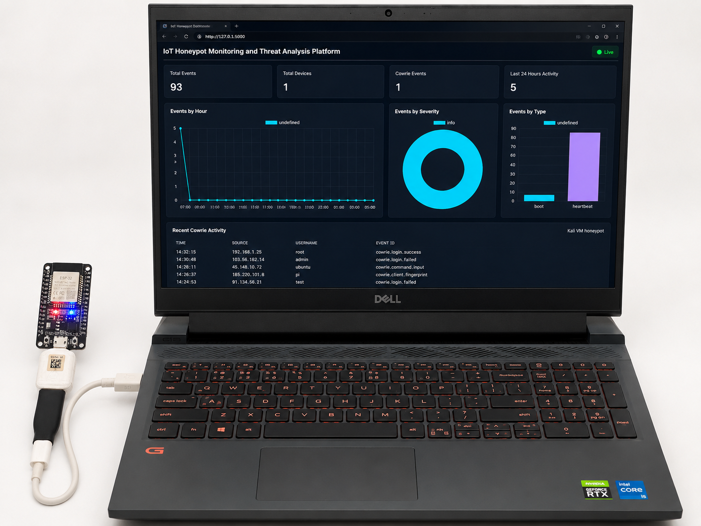
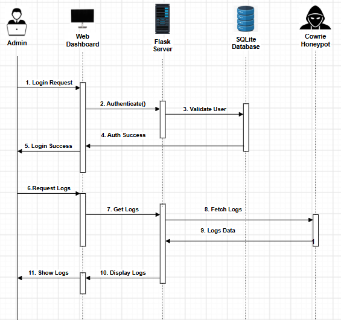
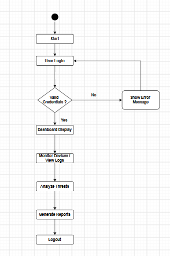
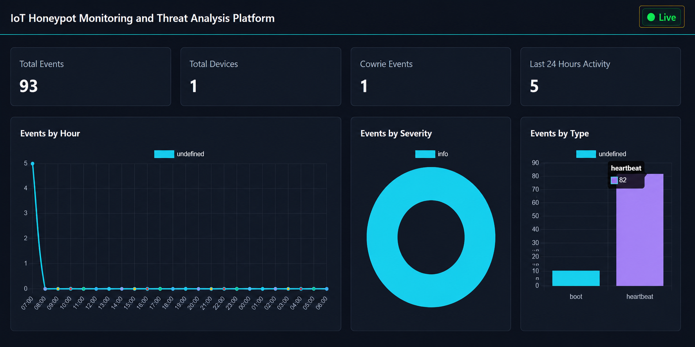
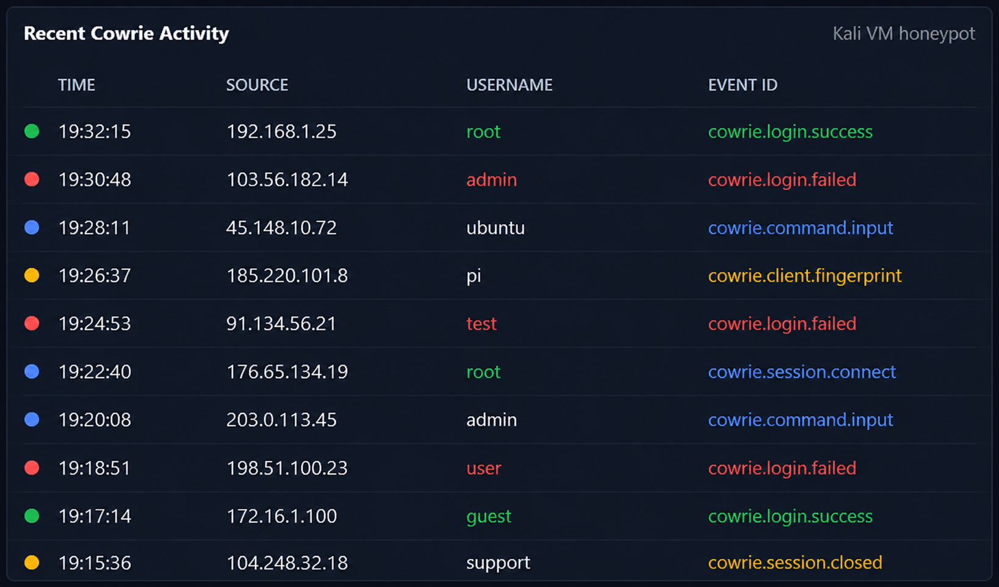
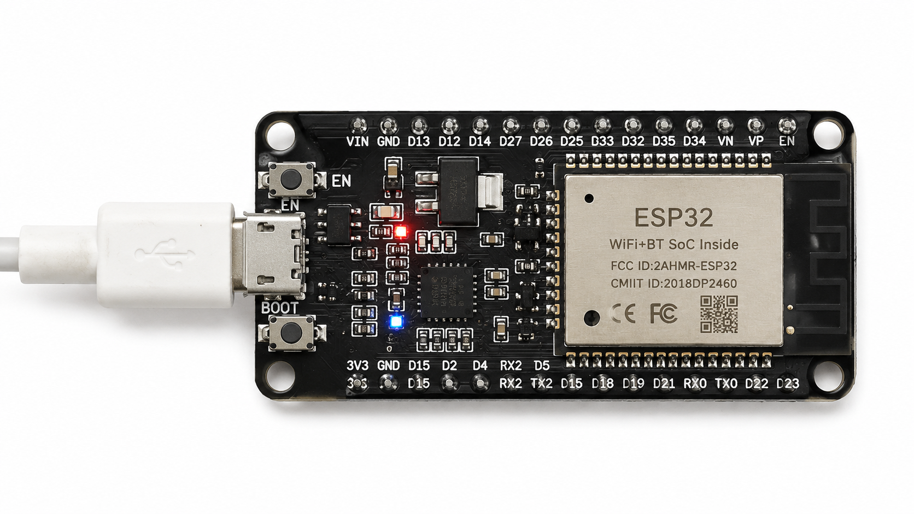

# IoT Honeypot Monitoring and Threat Analysis Platform

Production-quality academic defensive-security project that combines ESP32 telemetry, a Flask monitoring backend, SQLite storage, Socket.IO real-time updates, and Cowrie SSH honeypot activity in one centralized dashboard.



---

## 🏗️ Architecture

```text
ESP32 Device      ──( HTTP POST )──> Flask API ──> SQLite DB ──> Web Dashboard
Cowrie Honeypot   ──( cowrie.json )─> Parser    ──> Flask API ──> SQLite DB ──> Web Dashboard
```

| Communication Flow | Threat Analysis Flow |
| :---: | :---: |
|  |  |

---

## 📁 Repository Structure

```text
IoT-Honeypot-Monitoring-and-Threat-Analysis-Platform/
├── app.py
├── config.py
├── database.py
├── models.py
├── requirements.txt
├── README.md
├── assets/
├── routes/
│   ├── api.py
│   └── dashboard.py
├── services/
│   ├── validation.py
│   ├── telemetry.py
│   └── cowrie_service.py
├── parser/
│   └── cowrie_parser.py
├── templates/
│   └── dashboard.html
├── static/
│   ├── css/dashboard.css
│   └── js/dashboard.js
├── logs/
└── migrations/
```

---

## 📊 Live Monitoring Dashboard



The central dashboard aggregates real-time event logs, visualizes attack vectors by severity and type, and monitors client heartbeats without requiring manual browser refreshes.

### Real-Time Cowrie Attack Feed
Captures unauthorized logins, command execution, and client fingerprints in real time:



---

## 💻 Windows Setup & Installation

### 1. Environment Configuration
```powershell
# Create and activate virtual environment
python -m venv .venv
.\.venv\Scripts\Activate.ps1

# Install project dependencies
python -m pip install --upgrade pip
pip install -r requirements.txt
```

### 2. Set Environment Variables
```powershell
$env:SECRET_KEY = "replace-with-a-long-random-secret"
$env:DATABASE_URL = "sqlite:///instance/iot_honeypot.db"
```

### 3. Initialize DB and Run
```powershell
flask --app app init-db
python app.py
```

Access the interface at: `http://127.0.0.1:5000`

---

## ⚙️ Environment Variables

| Variable | Description | Default |
| :--- | :--- | :--- |
| `SECRET_KEY` | Flask and CSRF signing key | Development fallback |
| `DATABASE_URL` | SQLAlchemy database URI | `sqlite:///instance/iot_honeypot.db` |
| `LOG_LEVEL` | Application logging verbosity | `INFO` |
| `COWRIE_LOG_PATH` | Default Cowrie JSON log path | `logs/cowrie.json` |
| `SOCKETIO_ASYNC_MODE`| Socket.IO asynchronous runtime | `threading` |
| `FLASK_DEBUG` | Enable debug mode (1) or production (0) | `0` |

---

## 📡 REST API Endpoints

| Method | Endpoint | Purpose |
| :--- | :--- | :--- |
| `GET` | `/` | Real-time Bootstrap dashboard |
| `GET` | `/health` | Service health check endpoint |
| `POST` | `/api/device` | Register or update an ESP32 device |
| `GET` | `/api/device` | List registered devices |
| `GET` | `/api/devices` | Compatibility alias for listing devices |
| `POST` | `/api/log` | Store ESP32 telemetry event |
| `GET` | `/api/logs` | List telemetry (filters: `source_ip`, `device_name`, `event_type`) |
| `POST` | `/api/cowrie` | Store Cowrie JSON event or parse file via `log_path` |
| `GET` | `/api/cowrie` | List Cowrie events (filter: `source_ip`) |
| `GET` | `/api/stats` | Dashboard counters and chart data |

---

## 🔌 ESP32 Hardware Setup



### Board Configuration
1. Open **Arduino IDE** and add the ESP32 board URL to Preferences:
   ```text
   [https://raw.githubusercontent.com/espressif/arduino-esp32/gh-pages/package_esp32_index.json](https://raw.githubusercontent.com/espressif/arduino-esp32/gh-pages/package_esp32_index.json)
   ```
2. Install **esp32** from Boards Manager.
3. Open `esp32/esp32_honeypot.ino`.
4. Configure credentials:
   ```cpp
   const char* WIFI_SSID = "YOUR_WIFI_SSID";
   const char* WIFI_PASSWORD = "YOUR_WIFI_PASSWORD";
   const char* SERVER_BASE_URL = "http://YOUR_SERVER_IP:5000";
   ```
5. Select **ESP32 Dev Module** or **DOIT ESP32 DEVKIT V1** and flash the firmware.
6. Open the Serial Monitor at baud rate `115200`.

### Manual Telemetry Testing (PowerShell)

**Boot Event:**
```powershell
Invoke-RestMethod -Method Post -Uri [http://127.0.0.1:5000/api/log](http://127.0.0.1:5000/api/log) `
  -ContentType "application/json" `
  -Body '{"device_name":"ESP32_DEVKIT","event_type":"boot","severity":"info","payload":"device started"}'
```

**Heartbeat Event:**
```powershell
Invoke-RestMethod -Method Post -Uri [http://127.0.0.1:5000/api/log](http://127.0.0.1:5000/api/log) `
  -ContentType "application/json" `
  -Body '{"device_name":"ESP32_DEVKIT","event_type":"heartbeat","temperature":28,"humidity":70}'
```

---

## 🍯 Kali Cowrie Honeypot Integration

### 1. Installation on Kali Linux
```bash
sudo apt update
sudo apt install git python3-venv python3-pip authbind -y
git clone [https://github.com/cowrie/cowrie.git](https://github.com/cowrie/cowrie.git)
cd cowrie

python3 -m venv cowrie-env
source cowrie-env/bin/activate
pip install --upgrade pip
pip install -r requirements.txt
cp etc/cowrie.cfg.dist etc/cowrie.cfg
bin/cowrie start
```

### 2. Forward Cowrie Logs to Flask Host
Continuous streaming:
```bash
python3 cowrie_parser.py \
  --log /home/kali/cowrie/var/log/cowrie/cowrie.json \
  --api http://WINDOWS_HOST_IP:5000/api/cowrie \
  --follow
```

One-time sync from beginning of the file:
```bash
python3 cowrie_parser.py \
  --log /home/kali/cowrie/var/log/cowrie/cowrie.json \
  --api http://WINDOWS_HOST_IP:5000/api/cowrie \
  --from-start
```

### 3. Cowrie API Test (PowerShell)
```powershell
Invoke-RestMethod -Method Post -Uri [http://127.0.0.1:5000/api/cowrie](http://127.0.0.1:5000/api/cowrie) `
  -ContentType "application/json" `
  -Body '{"timestamp":"2026-05-30T10:00:00Z","src_ip":"192.0.2.44","username":"root","eventid":"cowrie.login.failed"}'
```

---

## 📂 Source Code Layout & Responsibilities

| File | Component Responsibility |
| :--- | :--- |
| `app.py` | Application factory, extension registration, logging, and database CLI commands |
| `config.py` | Environment variable parsing and application configuration profiles |
| `database.py` | SQLAlchemy ORM, Flask-SocketIO, and Flask-WTF CSRF initialization |
| `models.py` | Database schemas (`Device`, `Event`, `CowrieEvent`) |
| `routes/api.py` | REST API endpoints, JSON ingestion, and Socket.IO real-time broadcasts |
| `routes/dashboard.py` | Web UI template routes and health check handlers |
| `services/validation.py` | Strict payload validation for IP addresses, severity, timestamps, and schema types |
| `services/telemetry.py` | ESP32 persistence, filtering logic, and summary metric calculations |
| `services/cowrie_service.py` | Cowrie event deduplication and persistence logic |
| `parser/cowrie_parser.py` | Cowrie JSON log parsing and continuous streaming client |
| `templates/dashboard.html` | Real-time monitoring dashboard UI |
| `static/css/dashboard.css` | UI styles, responsive layouts, and dark theme design |
| `static/js/dashboard.js` | Socket.IO event listeners, dynamic Chart.js rendering, and live log search |
